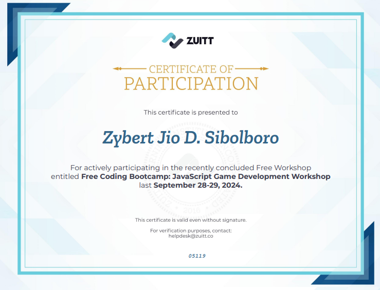

# 2048 Game 🎮

Welcome to my **2048 Game!** This is a modified version of the classic tile-merging puzzle game, where tiles feature images instead of numbers. It was developed during Zuitt's **Free Coding Bootcamp: JavaScript Game Development Workshop** on **September 28-29, 2024**. Dive in and see how many tiles you can merge!

## 🌐 Live Demo
You can play the game live at: [2048 Game Live Demo](https://zys1b.github.io/js-fcb/)  

---

## 📝 About the Project
This project is my introduction to game development, created as a hands-on experience in **JavaScript**, **HTML**, and **CSS**. By modifying the traditional 2048 game to use images, I learned how to implement visual elements and interactive design, enhancing the overall gaming experience. I’m excited to share this project as a testament to my first steps in programming and game development.

## 🎮 How to Play
- **Goal:** Slide tiles featuring images on a 4x4 grid to combine them and create new images.
- **Controls:** Use your arrow keys (⬆️⬇️⬅️➡️) or swipe to move tiles in any direction.
- **Gameplay:** When two tiles with the same image collide, they merge into one, creating a new image.
- **Win Condition:** Keep merging tiles to create unique images!

## 🛠️ Features
- **Image-Based Gameplay:** Engaging visuals replace traditional numerical tiles for a unique twist.
- **Responsive Design:** Smooth gameplay across both desktop and mobile devices.
- **Intuitive Controls:** Arrow key/Swipe navigation makes the game simple and enjoyable.
- **Score Tracking:** Your highest score is displayed and updated each game.

## 📜 Certificate of Completion
I'm proud to have earned this certificate for attending Zuitt's JavaScript Game Development Workshop:



---

## 💻 Tech Stack
- **HTML & CSS:** Layout and design for a seamless player experience
- **JavaScript:** Game logic and interactivity

## 🚀 Getting Started
To play the game locally:
1. **Clone the Repository:**
   ```bash
   git clone https://github.com/ZyS1b/js-fcb/
